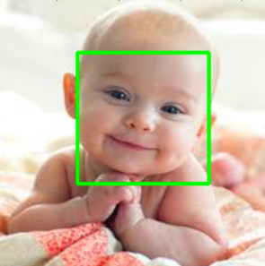

# Attendance-System-Using-OpenCV-Facial-Scan
Attendance System Using OpenCV Facial Scan

1. dataset creater - Stores id and name in database and captures the images of a face of a person.
2. trainer - trains the model on captures images with corresponding ids.
3. recognizer - recognizes a face from the trained model and gives corresponding id and display name from database.

